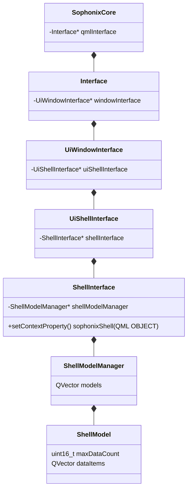

# Sophonix(智子系统)

---

>- 作者：ChenZR
>- 简介：个人应用软件
>- 日期：2026年4月7日

---

## 第一部分	需求分析

- 软件页面：
  - 终端：
  - 设备：
  - 主页：
  - 助手：
  - 设置：

## 第二部分	项目架构

- 目录结构：
  - moudle
  - resource
  - thirdParty
  - utility
  - CMakeLists.txt
  - main.cpp
  - Main.qml

## 第三部分	类结构

